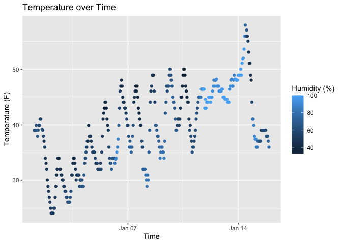

p8105_hw1_xc2784
================

## Problem 1

``` r
library(moderndive)
library(tidyverse)
```

    ## ── Attaching core tidyverse packages ──────────────────────── tidyverse 2.0.0 ──
    ## ✔ dplyr     1.1.4     ✔ readr     2.1.5
    ## ✔ forcats   1.0.0     ✔ stringr   1.5.1
    ## ✔ ggplot2   3.5.2     ✔ tibble    3.3.0
    ## ✔ lubridate 1.9.4     ✔ tidyr     1.3.1
    ## ✔ purrr     1.1.0     
    ## ── Conflicts ────────────────────────────────────────── tidyverse_conflicts() ──
    ## ✖ dplyr::filter() masks stats::filter()
    ## ✖ dplyr::lag()    masks stats::lag()
    ## ℹ Use the conflicted package (<http://conflicted.r-lib.org/>) to force all conflicts to become errors

``` r
data("early_january_weather")
```

### Dataset Description

The `early_january_weather` dataset contains hourly meteorological data
for LGA, JFK and EWR for the month of January 2013. It has 358 rows and
15 columns. The mean temperature during this period was 39.6 F.

Important variables include `origin` (weather station),
`year, month, day, hour` (time of recording), `temp` (temperature in F),
`dewp` (dew point in F), `humid` (relative humidity), `wind_dir` (wind
direction in degrees), `wind_speed` (wind speed in mph), `wind_gust`
(wind gust speed in mph) `precip` (precipitation in inches),
`pressure`(sea level pressure in millibars) `visib` (visibility in
miles),`time_hour`(Date and hour of the recording as a POSIXct date).

``` r
ggplot(early_january_weather, aes(x = time_hour, y = temp, color = humid)) +
  geom_point() +
  labs(
    title = "Temperature over Time",
    x = "Time",
    y = "Temperature (F)",
    color = "Humidity (%)"
  ) 
```

<!-- -->

``` r
ggsave("scatter_plot.pdf", height = 4, width = 6)
```

### Scatterplot description

The scatterplot shows that temperature generally increased over the two
weeks, with some fluctuations.Humidity tends to be higher at lower
temperatures and lower at higher temperatures.

## Problem 2

``` r
df = tibble(
  numberic_vec = rnorm(10),
  logical_vec = rnorm(10) > 0,
  char_vec    = letters[1:10], 
  factor_vec  = factor(rep(c("Level1","Level2","Level3"), length.out = 10)) 
)

df
```

    ## # A tibble: 10 × 4
    ##    numberic_vec logical_vec char_vec factor_vec
    ##           <dbl> <lgl>       <chr>    <fct>     
    ##  1        0.552 TRUE        a        Level1    
    ##  2       -0.973 FALSE       b        Level2    
    ##  3       -0.593 FALSE       c        Level3    
    ##  4        0.252 TRUE        d        Level1    
    ##  5       -2.42  FALSE       e        Level2    
    ##  6        1.81  TRUE        f        Level3    
    ##  7       -1.12  FALSE       g        Level1    
    ##  8        0.431 TRUE        h        Level2    
    ##  9        0.298 FALSE       i        Level3    
    ## 10       -0.202 TRUE        j        Level1

``` r
mean(pull(df,numberic_vec))   # works
```

    ## [1] -0.1962191

``` r
mean(pull(df,logical_vec))   # works
```

    ## [1] 0.5

``` r
mean(pull(df,char_vec))      # error
```

    ## Warning in mean.default(pull(df, char_vec)): argument is not numeric or
    ## logical: returning NA

    ## [1] NA

``` r
mean(pull(df,factor_vec))    # error
```

    ## Warning in mean.default(pull(df, factor_vec)): argument is not numeric or
    ## logical: returning NA

    ## [1] NA

``` r
as.numeric(pull(df,logical_vec))  # TRUE becomes 1, FALSE becomes 0
as.numeric(pull(df,char_vec))     # returns NA with warning
as.numeric(pull(df,factor_vec))   # assigns integers
```

When logical variables are converted to numeric, TRUE becomes 1, FALSE
becomes 0 because TRUE is coerced to 1 and FALSE to 0. This explains why
taking the mean of a logical vector gives the proportion of TRUE values.

When character variables are converted to numeric, R returns NAs with a
warning because characters cannot be meaningfully turned into numbers,
which explains why their mean cannot be computed.

When factor variables are converted to numeric, R returns the integers
assigned to each level. Since those numbers don’t really mean anything,
averaging them would not represent a meaningful statistic, which
explains why mean() does not work for factor variables.
